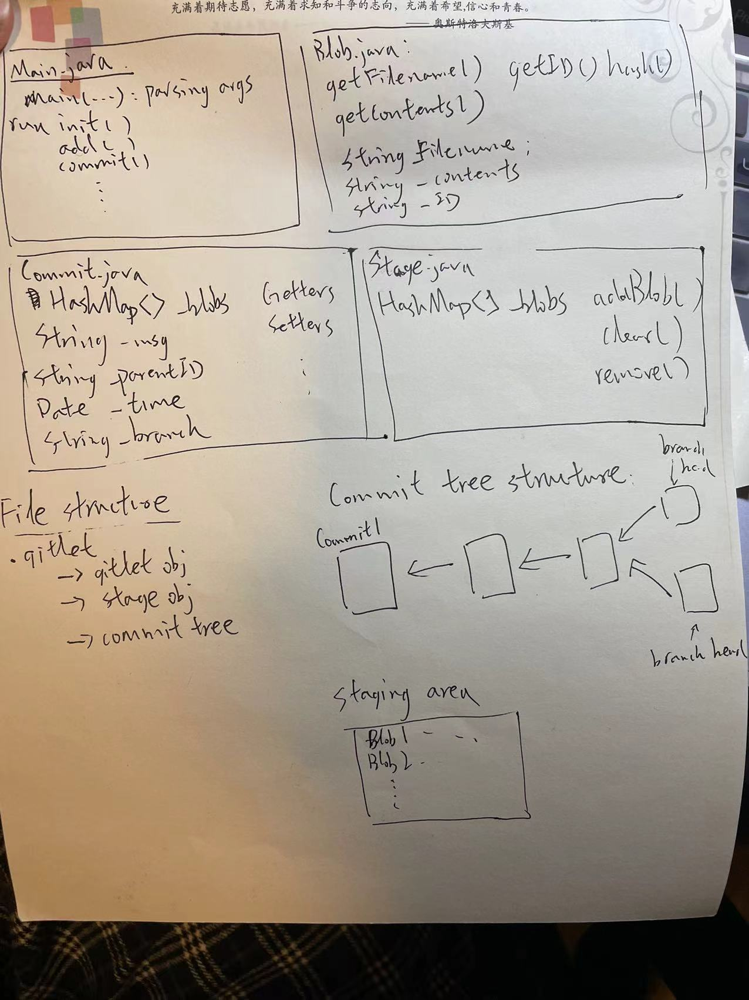

# Gitlet Design Document
author: Alex Liang

## Design Document Guidelines

Please use the following format for your Gitlet design document. Your design
document should be written in markdown, a language that allows you to nicely 
format and style a text file. Organize your design document in a way that 
will make it easy for you or a course-staff member to read.  

## 1. Classes and Data Structures

Include here any class definitions. For each class list the instance
variables and static variables (if any). Include a ***brief description***
of each variable and its purpose in the class. Your explanations in
this section should be as concise as possible. Leave the full
explanation to the following sections. You may cut this section short
if you find your document is too wordy.

### Main.java
This class is the entry point of the program. It implements methods to set up persistance and support each command of 
the program.

### Blob.java
This class represents each file. It contains all the information of the file, including the filename, hashid, and file 
contents.

### Commit.java
This class is the representation of each commit. It contains all the blobs commited, commit time, commit id, 
branch information, and any other information we need to keep track of for each commit.

### Stage.java
This class represents the staging area after add operations. It should contain all the files that are staged but not yet
commited.

### Gitlet.java
This class is the tree structure of Gitlet. It keeps track of all the information of the current Gitlet repository

## 2. Algorithms

This is where you tell us how your code works. For each class, include
a high-level description of the methods in that class. That is, do not
include a line-by-line breakdown of your code, but something you would
write in a javadoc comment above a method, ***including any edge cases
you are accounting for***. We have read the project spec too, so make
sure you do not repeat or rephrase what is stated there.  This should
be a description of how your code accomplishes what is stated in the
spec.

The length of this section depends on the complexity of the task and
the complexity of your design. However, simple explanations are
preferred. Here are some formatting tips:

* For complex tasks, like determining merge conflicts, we recommend
  that you split the task into parts. Describe your algorithm for each
  part in a separate section. Start with the simplest component and
  build up your design, one piece at a time. For example, your
  algorithms section for Merge Conflicts could have sections for:

   * Checking if a merge is necessary.
   * Determining which files (if any) have a conflict.
   * Representing the conflict in the file.
  
* Try to clearly mark titles or names of classes with white space or
  some other symbols.

### Main.java
1. main(String[] args): This is the entry point of the program. It first checks to make sure that the input array is 
not empty. Then, it calls `initGitlet` to create the `.gitlet` persistance. Lastly, depending on the input argument, 
different functions are called to perform the operation.
2. runInit(): If `.gitlet` folder does not exist in CWD, create the folder and associated files needed.
3. runAdd(Gitlet gl, String[] args):
4. runCommit(Gitlet gl, String[] args):
5. runRm(Gitlet gl, String[] args):
6. runLog(Gitlet gl, String[] args):
7. runGlobalLog(Gitlet gl, String[] args):
8. runFind(Gitlet gl, String[] args):
9. runStatus(Gitlet gl, String[] args):
10. runCheckout(Gitlet gl, String[] args):
11. runBranch(Gitlet gl, String[] args):
12. runRmBranch(Gitlet gl, String[] args):
13. runReset(Gitlet gl, String[] args):
14. runMerge(Gitlet gl, String[] args):

### Blob.java
1. Blob(String filename): Create a blob object corresponding to the file filename.
2. getFilename(): Get the name of the file.
3. getID(): Get the hash ID of the blob.
4. hash(): Generate an ID for the file.
5. getContents(): Geth the contents written in the file.

### Commit.java
1. Commit(HashMap<String, Blob> blobs, String msg, String parentID, String branch): Construct a commit
2. getBlobs(): Geth the blobs in that commit
3. getMessage(): Get the commit message.
4. getParent(): Get the parent of the commit.
5. getBranch(): Get the branch of the commit.
6. TBD

### Stage.java
1. Stage(): Create an empty staging area.
2. addBlob(String filename): Add a file to the staging area.
3. clear(): Clear the staging area.
4. remove(String filename): Remove a file from the staging area.
5. TBD

### Gitlet.java
1. Gitlet(): Construct a new Gitlet system.
2. init(): If `.gitlet` folder does not exist in CWD, create the folder and associated files needed.
3. add():
4. commit():
5. rm():
6. log():
7. global_log():
8. find():
9. status():
10. checkout():
11. branch():
12. rm_branch():
13. reset():
14. merge():

## 3. Persistence

Describe your strategy for ensuring that you don’t lose the state of your program
across multiple runs. Here are some tips for writing this section:

* This section should be structured as a list of all the times you
  will need to record the state of the program or files. For each
  case, you must prove that your design ensures correct behavior. For
  example, explain how you intend to make sure that after we call
       `java gitlet.Main add wug.txt`,
  on the next execution of
       `java gitlet.Main commit -m “modify wug.txt”`, 
  the correct commit will be made.
  
* A good strategy for reasoning about persistence is to identify which
  pieces of data are needed across multiple calls to Gitlet. Then,
  prove that the data remains consistent for all future calls.
  
* This section should also include a description of your .gitlet
  directory and any files or subdirectories you intend on including
  there.

### init
- Create a ".gitlet" folder in the current working direcory. A gitlet object is created and serialized so that it can 
be stored in this folder.
- A commit tree is created and stored in a serialized file in .gitlet folder. The Gitlet object has the ability to access
and modify the commit tree. All the operations are done by the Gitlet object

### add
- Create a Stage object, serialized, and stored in ".gitliet" folder. 

### commit [message]
- Create a Commit object and add it to the commit tree. Saves a snapshot of tracked files in the current commit and 
staging area so they can be restored at a later time, creating a new commit. A commit will save and start tracking any 
files that were staged for addition but weren't tracked by its parent.

### rm [file name]
- Access the Stage object and remove the file.

### log
- Access the commit tree through Gitlet object and iterate through it. Starting at the current head commit, display 
information about each commit backwards along the commit tree until the initial commit, following the first parent commit 
links, ignoring any second parents found in merge commits.

### global-log
- Like log, except displays information about all commits ever made.

### find [commit message]
- Access the commit tree through Gitlet object and iterate through it. Print out all the information needed.

### status
- Access the staging area and branch info through Gitlet object. Displays what branches currently exist, and marks the 
current branch with a *. Also displays what files have been staged for addition or removal.

### checkout (-- [file name]) ([commit id] -- [file name]) ([branch name])
- Access the commit trees vid Gitlet object.

### branch [branch name]
- Add the branch information in the Gitlet object.

### rm-branch [branch name]
- Deletes the pointer associated with the branch with the given name in the Gitlet object.

### reset [commit id]
- Access the commit in the commit tree. Access all the Blob object stores in the Commit and remove local files that are
not in there. 

### merge [branch name]
- TBD

## 4. Design Diagram

Attach a picture of your design diagram illustrating the structure of your
classes and data structures. The design diagram should make it easy to 
visualize the structure and workflow of your program.

